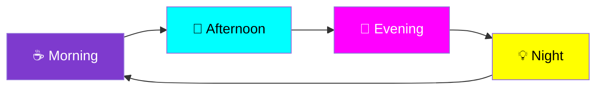
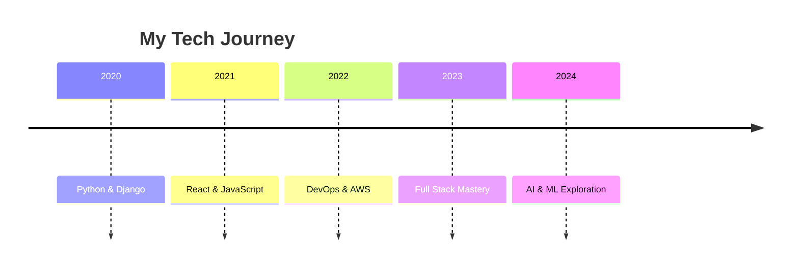

# 🚀 **Adelana Oluwafunmibi** - Full Stack Developer Extraordinaire 🎨

<!-- Animated Header -->

<!-- Animated Badges -->

  
  
  

<!-- Animated Divider -->

<h2 align="center">⚡ Full Stack Developer • Python & Django Specialist • React Artist ⚡</h2>

 

<!-- Animated Stats -->

 

## 🎨 **Tech Stack & Superpowers**

### **🌈 Backend Magic**

  
  
  
  
  

### **🎪 Frontend Circus**

  
  
  
  
  

### **🎯 Database Dynamite**

  
  
  
  

### **🚀 DevOps & Automation Rockets**

  
  
  
  
  

 

<!-- Animated Divider -->

 

## 📊 **GitHub Analytics & Magic Metrics**

<!-- Animated Stats Grid -->
<table>
  <tr>
    <td>
      
    </td>
    <td>
      
    </td>
  </tr>
</table>

 

<!-- Animated Activity Graph -->

 

<!-- Animated Divider -->

 

## 🎭 **What I Bring to the Party**

<!-- Animated Skills Grid -->
<table>
  <tr>
    <td width="25%" align="center">
      <h3>🎪 Backend Circus</h3>
      
🔄 RESTful APIs

      
🗄️ Database Design

      
🔐 Authentication

      
🛡️ Security Systems

      
⚡ Performance

    </td>
    <td width="25%" align="center">
      <h3>🎨 Frontend Magic</h3>
      
⚛️ React Apps

      
📱 Responsive Design

      
🎯 UI/UX

      
🔷 Modern JavaScript

      
🎭 Animations

    </td>
    <td width="25%" align="center">
      <h3>🚀 DevOps Fireworks</h3>
      
🐳 Docker

      
☁️ AWS

      
⚡ CI/CD

      
🚀 Deployment

      
🤖 n8n Automation

    </td>
    <td width="25%" align="center">
      <h3>💡 Innovation</h3>
      
🧠 Problem Solving

      
🚀 Scalability

      
🎨 Creative Solutions

      
⚡ Fast Learning

      
🌟 Quality Code

    </td>
  </tr>
</table>

 

## 🎯 **Current Projects & Adventures**

<!-- Animated Projects Grid -->
<table>
  <tr>
    <td width="50%" align="center">
      <h3>🔥 Building Now</h3>
      
⚡ Scalable E-commerce APIs

      
🎯 React Dashboard Systems

      
🔐 Secure Auth Systems

      
🤖 Automation Tools

      
🌐 Real-time Applications

    </td>
    <td width="50%" align="center">
      <h3>🌱 Learning Next</h3>
      
⚛️ Advanced React Patterns

      
☁️ AWS Advanced Services

      
🔧 Microservices Architecture

      
🎨 Three.js & WebGL

      
🤖 Machine Learning

    </td>
  </tr>
</table>

 

<!-- Animated Divider -->

 

## 🏆 **GitHub Trophies & Achievements**

<!-- Animated Trophies -->

 

<!-- Animated Divider -->

 

## 💫 **Let's Create Magic Together!**

<!-- Animated Contact Buttons -->

  
  
  
  

 

## 🎪 **Fun Stats & Random Facts**

<!-- Animated Stats Grid -->
<table>
  <tr>
    <td align="center">
      <b>10,000+</b> 🚀 Lines of Code
    </td>
    <td align="center">
      <b>50+</b> 🎯 APIs Built
    </td>
    <td align="center">
      <b>25+</b> ⚡ Technologies
    </td>
    <td align="center">
      <b>∞</b> ☕ Coffee Cups
    </td>
  </tr>
  <tr>
    <td align="center">
      <b>100%</b> 🎨 Creative
    </td>
    <td align="center">
      <b>24/7</b> 💻 Code Mode
    </td>
    <td align="center">
      <b>🚀</b> Fast Learner
    </td>
    <td align="center">
      <b>🔥</b> Problem Solver
    </td>
  </tr>
</table>

 

<!-- Animated Divider -->

 

## 🎊 **Daily Coding Rhythm**

<!-- Animated Code Block -->

 

## 🌟 **Featured Projects Showcase**

<!-- Animated Project Cards -->
<table>
  <tr>
    <td width="33%" align="center">
      <h3>🎯 E-commerce API</h3>
      
Django REST + React

      
Scalable & Secure

      
Real-time Features

       
      
    </td>
    <td width="33%" align="center">
      <h3>🚀 Dashboard System</h3>
      
React + TypeScript

      
Responsive Design

      
Advanced Charts

       
      
    </td>
    <td width="33%" align="center">
      <h3>🤖 Automation Tool</h3>
      
Python + n8n

      
Workflow Automation

      
Custom Integrations

       
      
    </td>
  </tr>
</table>

 

<!-- Animated Divider -->

 

## 📈 **Live Coding Activity**

<!-- Animated Activity Graph -->

 

## 🎨 **Tech Journey Timeline**

<!-- Animated Timeline -->

 

<!-- Animated Footer -->

## 🌟 **"Turning coffee into code, ideas into interfaces, and problems into elegant solutions — one colorful commit at a time!"** 🌟

---

### **⚡ Ready to build something amazing together? Let's connect! ⚡**

<!-- Animated Footer Badges -->

  
  
  

## 🎯 **Quick Stats Overview**

<!-- Animated Mini Stats -->
<table>
  <tr>
    <td align="center">
      
    </td>
    <td align="center">
      
    </td>
  </tr>
</table>

 

<!-- Final Animated Message -->

