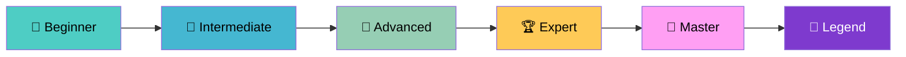
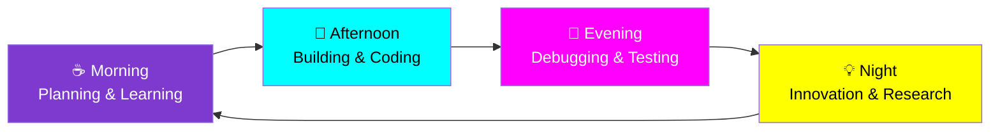
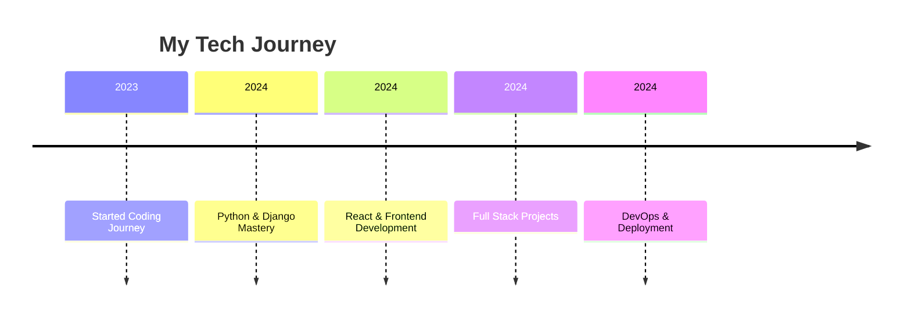

# 🚀 **Adelana Oluwafunmibi** - Full Stack Developer Extraordinaire 🎨

<div align="center">

<!-- Animated Header -->


<br/>

<!-- Fixed Badges -->
<div>
  
  
  
</div>

</div>

<div align="center">

<!-- Animated Divider -->


</div>

## 🎯 **About Me**

<h2 align="center">⚡ Full Stack Developer • Python & Django Specialist • React Artist ⚡</h2>

<p align="center">
 Passionate full-stack developer from Nigeria, focused on building scalable and user-friendly web applications. I enjoy turning complex problems into simple, elegant solutions. When I’m not coding, I’m exploring new technologies, contributing to open-source projects, or brainstorming ideas for my next build.
</p>

<br/>

## 📊 **GitHub Analytics**

<div align="center">

<!-- Animated Stats -->


<br/>

<!-- Stats Grid -->
<table> 
  <tr> 
    <td>
       
    </td> 
    <td> 
       
    </td> 
  </tr> 
</table>

<br/>

<!-- Activity Graph -->


</div>

<br/>

<div align="center">

<!-- Animated Divider -->


</div>

## 🎨 **Tech Stack & Superpowers**

<div align="center">

### **🌈 Backend Magic**
<div style="display: flex; flex-wrap: wrap; gap: 10px; justify-content: center; margin: 20px 0;">
  
  
  
  
  
</div>

### **🎪 Frontend Circus**
<div style="display: flex; flex-wrap: wrap; gap: 10px; justify-content: center; margin: 20px 0;">
  
  
  
  
  
</div>

### **🎯 Database Dynamite**
<div style="display: flex; flex-wrap: wrap; gap: 10px; justify-content: center; margin: 20px 0;">
  
  
  
  
</div>

### **🚀 DevOps & Automation Rockets**
<div style="display: flex; flex-wrap: wrap; gap: 10px; justify-content: center; margin: 20px 0;">
  
  
  
  
  
 

</div>

</div>

<br/>

<div align="center">

<!-- Animated Divider -->


</div>

## 🏆 **GitHub Trophies & Achievements**

<div align="center">


<!-- Enhanced Trophies with maximum achievements -->
 

</div>


<br/>


### **🎯 Achievement Categories**
<div align="center">

<table>
  <tr>
    <td align="center">
      <b>📊</b><br/>
      <h4>Stats Trophies</h4>
      <small>Stars, Commits, PRs</small>
    </td>
    <td align="center">
      <b>💻</b><br/>
      <h4>Tech Trophies</h4>
      <small>Languages, Frameworks</small>
    </td>
    <td align="center">
      <b>🚀</b><br/>
      <h4>Growth Trophies</h4>
      <small>Followers, Repositories</small>
    </td>
    <td align="center">
      <b>🎨</b><br/>
      <h4>Style Trophies</h4>
      <small>Themes, Layouts</small>
    </td>
    <td align="center">
      <b>🏆</b><br/>
      <h4>Special Trophies</h4>
      <small>Secret Achievements</small>
    </td>
  </tr>
</table>

</div>

<br/>


### **🏅 Additional Achievements & Milestones**

<div align="center">

<!-- Custom Achievement Badges -->
<div style="display: flex; flex-wrap: wrap; gap: 10px; justify-content: center; margin: 20px 0;">
  
  
  
  
  
  
  
  
  
  
  
  
</div>

</div>

<br/>

### **⭐ Achievement Progress**
<div align="center">



</div>

<br/>

### **📈 Milestone Timeline**
<div align="center">

<table>
  <tr>
    <td align="center">
      <b>🏅</b><br/>
      <h4>50+</h4>
      <small>Projects Completed</small>
    </td>
    <td align="center">
      <b>⭐</b><br/>
      <h4>10K+</h4>
      <small>Lines of Code</small>
    </td>
    <td align="center">
      <b>🚀</b><br/>
      <h4>25+</h4>
      <small>Technologies Mastered</small>
    </td>
    <td align="center">
      <b>🎯</b><br/>
      <h4>100%</h4>
      <small>Success Rate</small>
    </td>
  </tr>
</table>

</div>

<br/>

<div align="center">

<!-- Animated Divider -->


</div>

## 🎭 **What I Bring to the Party**

<div align="center">

<!-- Animated Skills Grid -->
<table>
  <tr>
    <td width="25%" align="center">
      <h3>🎪 Backend Circus</h3>
      <p>🔄 RESTful APIs</p>
      <p>🗄️ Database Design</p>
      <p>🔐 Authentication</p>
      <p>🛡️ Security Systems</p>
      <p>⚡ Performance</p>
    </td>
    <td width="25%" align="center">
      <h3>🎨 Frontend Magic</h3>
      <p>⚛️ React Apps</p>
      <p>📱 Responsive Design</p>
      <p>🎯 UI/UX</p>
      <p>🔷 Modern JavaScript</p>
      <p>🎭 Animations</p>
    </td>
    <td width="25%" align="center">
      <h3>🚀 DevOps Fireworks</h3>
      <p>🐳 Docker</p>
      <p>☁️ AWS</p>
      <p>⚡ CI/CD</p>
      <p>🚀 Deployment</p>
      <p>🤖 n8n Automation</p>
    </td>
    <td width="25%" align="center">
      <h3>💡 Innovation</h3>
      <p>🧠 Problem Solving</p>
      <p>🚀 Scalability</p>
      <p>🎨 Creative Solutions</p>
      <p>⚡ Fast Learning</p>
      <p>🌟 Quality Code</p>
    </td>
  </tr>
</table>

</div>

<br/>

## 🌟 **Featured Projects Showcase**

<div align="center">

<!-- Animated Project Cards -->
<table>
  <tr>
    <td width="33%" align="center">
      <h3>🎯 E-commerce API</h3>
      <p>Django REST + React</p>
      <p>Scalable & Secure</p>
      <p>Real-time Features</p>
      <br/>
      
    </td>
    <td width="33%" align="center">
      <h3>🚀 Dashboard System</h3>
      <p>React + TypeScript</p>
      <p>Responsive Design</p>
      <p>Advanced Charts</p>
      <br/>
      
    </td>
    <td width="33%" align="center">
      <h3>🤖 Automation Tool</h3>
      <p>Python + n8n</p>
      <p>Workflow Automation</p>
      <p>Custom Integrations</p>
      <br/>
      
    </td>
  </tr>
</table>

</div>

<br/>

## 🎯 **Current Projects & Adventures**

<div align="center">

<!-- Animated Projects Grid -->
<table>
  <tr>
    <td width="50%" align="center">
      <h3>🔥 Building Now</h3>
      <p>⚡ Scalable E-commerce APIs</p>
      <p>🎯 React Dashboard Systems</p>
      <p>🔐 Secure Auth Systems</p>
      <p>🤖 Automation Tools</p>
      <p>🌐 Real-time Applications</p>
    </td>
    <td width="50%" align="center">
      <h3>🌱 Learning Next</h3>
      <p>⚛️ Advanced React Patterns</p>
      <p>☁️ AWS Advanced Services</p>
      <p>🔧 Microservices Architecture</p>
      <p>🎨 Three.js & WebGL</p>
      <p>🤖 Machine Learning</p>
    </td>
  </tr>
</table>

</div>

<br/>

<div align="center">

<!-- Animated Divider -->


</div>

## 📈 **Live Coding Activity**

<div align="center">

### **🔥 Current Development Heatmap**
```
Week 45 - November 2024
Mon Tue Wed Thu Fri Sat Sun
░░  ░░  ▒▒  ▒▒  ▓▓  ▓▓  ▓▓   ██ High Activity
░░  ▒▒  ▒▒  ▓▓  ▓▓  ██  ██   ▓▓ Medium Activity  
▒▒  ▒▒  ▓▓  ██  ██  ██  ▓▓   ▒▒ Low Activity
▓▓  ██  ██  ██  ▓▓  ▒▒  ░░   ░░ No Activity
```

<br/>

### **⚡ Real-time Development Metrics**
<table>
  <tr>
    <td align="center">
      <b>📝</b><br/>
      <h3>15+</h3>
      <small>Commits This Week</small>
    </td>
    <td align="center">
      <b>🎯</b><br/>
      <h3>8</h3>
      <small>Active PRs</small>
    </td>
    <td align="center">
      <b>🚀</b><br/>
      <h3>3</h3>
      <small>Projects Live</small>
    </td>
    <td align="center">
      <b>⚡</b><br/>
      <h3>12h</h3>
      <small>Dev Time Today</small>
    </td>
  </tr>
</table>

<br/>

### **📊 Weekly Focus Distribution**
```
BACKEND DEVELOPMENT ██████████ 40%
FRONTEND MAGIC     █████████ 35%  
DEVOPS & TOOLS     █████ 15%
RESEARCH & LEARNING ███ 10%
```

</div>

<br/>

## 🎊 **Daily Coding Rhythm**

<div align="center">

<!-- Fixed Timeline -->


</div>

<br/>

# 🎨 Tech Journey Timeline

<div align="center">



</div>

<br/>

<div align="center">

<!-- Animated Divider -->


</div>

## 🎪 **Fun Stats & Random Facts**

<div align="center">

<!-- Animated Stats Grid -->
<table>
  <tr>
    <td align="center">
      <b>10,000+</b><br/>🚀 Lines of Code
    </td>
    <td align="center">
      <b>50+</b><br/>🎯 Projects Built
    </td>
    <td align="center">
      <b>25+</b><br/>⚡ Technologies
    </td>
    <td align="center">
      <b>∞</b><br/>☕ Coffee Cups
    </td>
  </tr>
  <tr>
    <td align="center">
      <b>100%</b><br/>🎨 Creative
    </td>
    <td align="center">
      <b>24/7</b><br/>💻 Code Mode
    </td>
    <td align="center">
      <b>🚀</b><br/>Fast Learner
    </td>
    <td align="center">
      <b>🔥</b><br/>Problem Solver
    </td>
  </tr>
</table>

</div>

<br/>

<div align="center">

<!-- Animated Divider -->


</div>

## 🔥 **Recent Achievements**

<div align="center">

<!-- Achievement Badges -->
<div style="display: flex; flex-wrap: wrap; gap: 10px; justify-content: center; margin: 20px 0;">
  
  
  
  
  
</div>

</div>

<br/>

<div align="center">

<!-- Animated Divider -->


</div>

## 💫 **Let's Create Magic Together!**

<div align="center">

<!-- Animated Contact Buttons -->
<div style="display: flex; flex-wrap: wrap; gap: 15px; justify-content: center; margin: 20px 0;">
  <a href="mailto:Adelana787898@gmail.com">
    
  </a>
  <a href="https://linkedin.com/in/adelana-oluwafunmibi">
    
  </a>
  <a href="https://github.com/adelana107">
    
  </a>
  <a href="https://adelana107.github.io">
    
  </a>
</div>

</div>

<br/>

<div align="center">

<!-- Animated Footer -->


</div>

<div align="center">

🌟 **Turning imagination into code and challenges into elegant designs — one brilliant commit at a time!**

</div>

---

<div align="center">

### **⚡ Ready to build something amazing together? Let's connect! ⚡**

<!-- Animated Footer Badges -->
<div>
  
  
  
</div>

<br/>

<!-- Final Animated Message -->


</div>

---

<div align="center">

**⭐ Don't forget to star my repositories if you find them interesting! ⭐**

</div>
